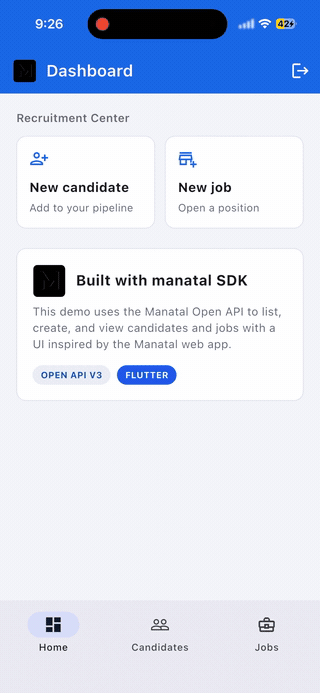
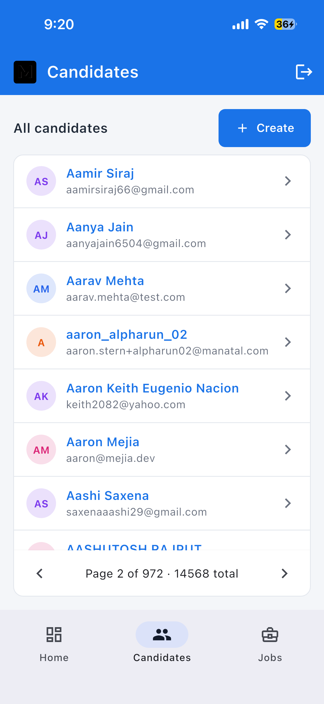
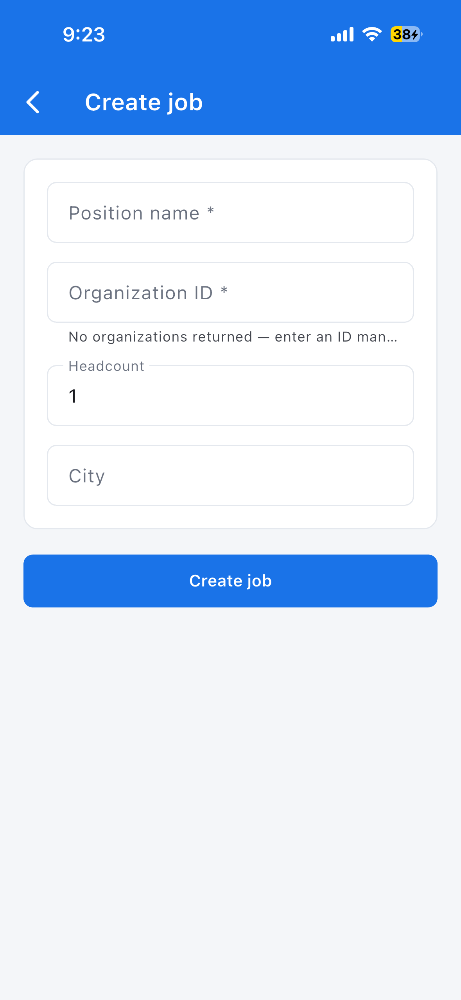

# manatal

[](https://pub.dev/packages/manatal)

The easiest way to use the [Manatal](https://app.manatal.com/) Open API from Dart and Flutter — build a **Manatal mobile app**, internal tools, or any integration with the Manatal ATS.

**Install from pub.dev:** [`manatal`](https://pub.dev/packages/manatal)

[Manatal](https://app.manatal.com/) is an AI-powered ATS built for modern recruiting teams. Use this SDK to connect the [Manatal app](https://app.manatal.com/) with your own software — sync candidates and jobs, automate workflows, and integrate one of the best ATS platforms into your stack — with auth, pagination, and retries handled for you.

> **Note:** Community-maintained package. Not affiliated with or officially supported by Manatal.

## Manatal app · Flutter · mobile

Searching for a **Manatal app**, **Manatal Flutter**, or **Manatal mobile app** SDK? This single package includes both the API client and Flutter list widgets:

- Build a **Manatal Flutter mobile app** for iOS and Android
- Connect a custom mobile or desktop app to the **Manatal ATS**
- Use the **Manatal Open API** from Dart without writing HTTP boilerplate
- Drop-in paginated lists with `ManatalCandidateList`, `ManatalJobList`, and more via `package:manatal/flutter.dart`

Keywords: Manatal app, Manatal API, Manatal SDK, Manatal Flutter, Manatal mobile app, Manatal iOS, Manatal Android, ATS API, recruiting app.

## Why use this package?

Whether you are extending an AI-powered ATS workflow or connecting Manatal to HRIS/payroll systems, calling the Open API raw means handling tokens, pagination, and retries yourself. `manatal` wraps that into a small, predictable client:

- One line to authenticate
- Simple resource methods (`candidates`, `jobs`, `matches`, …)
- Automatic pagination
- Automatic retries on temporary errors
- Clear exceptions for common API errors
- Flutter list widgets with built-in pagination

## Installation

One dependency — client and widgets together:

```bash
flutter pub add manatal
```

Or in `pubspec.yaml`:

```yaml
dependencies:
  manatal: ^0.1.5
```

Requires Dart SDK 3.3+ and Flutter 3.16+.

## Example app

See [`example/`](example/) for a full Flutter demo with Manatal-style UI — list/create candidates and jobs, detail screens, and pagination.

```bash
cd example
flutter run --dart-define=MANATAL_API_KEY=YOUR_OPEN_API_TOKEN
```

### Screenshots




| Candidates | Jobs |
|------------|------|
|  |  |

| Candidate detail | Job detail |
|------------------|------------|
|  |  |

| Create candidate | Create job |
|------------------|------------|
|  |  |

More screenshots and the full walkthrough: [example/README.md](example/README.md).

## How to get an Open API token

Open API access depends on your Manatal plan. Follow the official guide:
[Manatal Open API](https://support.manatal.com/docs/manatal-api).

### 1. Enable Open API

1. Sign in to [Manatal](https://app.manatal.com/).
2. Go to **Administration → Features → Open API**, or open  
   [Open API settings](https://app.manatal.com/administration/features/open-api).
3. If it is not enabled yet, click **Contact our support** to request access.

> Open API is available by default on the **Enterprise Plus** plan. See the [support article](https://support.manatal.com/docs/manatal-api) for details.

### 2. Generate a token

1. Open the same [Open API settings](https://app.manatal.com/administration/features/open-api) page.
2. Click **Generate new token**.
3. Copy the token and store it securely.

### 3. Use the token in Dart

```dart
import 'package:manatal/manatal.dart';

final client = ManatalClient(apiKey: 'YOUR_OPEN_API_TOKEN');
```

Or set an environment variable:

```bash
export MANATAL_API_KEY="YOUR_OPEN_API_TOKEN"
```

```dart
final client = ManatalClient(); // reads MANATAL_API_KEY on VM/desktop
```

## Quick start — API client

```dart
import 'package:manatal/manatal.dart';

Future<void> main() async {
  final client = ManatalClient(apiKey: 'YOUR_OPEN_API_TOKEN');

  final candidate = await client.candidates.create({
    'full_name': 'Jane Doe',
    'email': 'jane@example.com',
  });
  print(candidate.id);

  await for (final job in client.jobs.list()) {
    print(job.id);
    print(job.position_name);
  }

  client.close();
}
```

API responses support both styles:

```dart
final job = await client.jobs.create({
  'organization': 2208123,
  'position_name': 'pyp',
});
print(job.id);          // recommended
print(job['id']);       // still works
print(job.position_name);
```

## Quick start — Flutter mobile app

```dart
import 'package:flutter/material.dart';
import 'package:manatal/flutter.dart';

class CandidatesScreen extends StatefulWidget {
  const CandidatesScreen({super.key});

  @override
  State<CandidatesScreen> createState() => _CandidatesScreenState();
}

class _CandidatesScreenState extends State<CandidatesScreen> {
  late final ManatalClient _client;

  @override
  void initState() {
    super.initState();
    _client = ManatalClient(apiKey: 'YOUR_OPEN_API_TOKEN');
  }

  @override
  void dispose() {
    _client.close();
    super.dispose();
  }

  @override
  Widget build(BuildContext context) {
    return Scaffold(
      appBar: AppBar(title: const Text('Candidates')),
      body: ManatalCandidateList(client: _client),
    );
  }
}
```

Custom rows:

```dart
ManatalCandidateList(
  client: client,
  itemBuilder: (context, candidate) => ListTile(
    title: Text(candidate.full_name),
    subtitle: Text(candidate.email),
    onTap: () => print(candidate.id),
  ),
)
```

### Flutter widgets

| Widget | API resource |
|--------|--------------|
| `ManatalCandidateList` | Candidates |
| `ManatalJobList` | Jobs |
| `ManatalOrganizationList` | Organizations |
| `ManatalMatchList` | Matches |
| `ManatalPaginatedList` | Any resource (generic) |

Infinite scroll:

```dart
ManatalCandidateList(
  client: client,
  mode: ManatalPaginationMode.infinite,
)
```

## What you can access

| Resource | Example |
|----------|---------|
| Candidates | `client.candidates.list()` |
| Jobs | `client.jobs.create({'organization': 1, 'position_name': 'Engineer'})` |
| Organizations | `client.organizations.list()` |
| Matches | `client.matches.create({'candidate': 123, 'job': 456})` |
| Contacts | `client.contacts.list()` |
| Users | `client.users.list()` |
| Skills & lookups | `client.skills.list()`, `client.currencies.list()` |

Nested data works the same way:

```dart
await client.candidates.notes(123).create({'info': 'Called candidate'});
await client.candidates.experiences(123).list().length;
await client.jobs.attachments(456).list().length;
```

## Pagination

By default, `.list()` returns **all** matching results. Need a single page?

```dart
final page = await client.candidates.listPage(page: 1);
print(page.count);
print(page.results.length);
```

## Error handling

```dart
try {
  await client.candidates.retrieve(999999);
} on NotFoundException catch (e) {
  print(e.statusCode, e.body);
} on ValidationException catch (e) {
  print(e.body);
} on RateLimitException {
  print('Too many requests — try again later');
} on AuthenticationException {
  print('Check your API token');
}
```

## Useful links

| Resource | Link |
|----------|------|
| **Dart / Flutter SDK (pub.dev)** | https://pub.dev/packages/manatal |
| Manatal app | https://app.manatal.com/ |
| Enable Open API & generate tokens | https://support.manatal.com/docs/manatal-api |
| Open API settings | https://app.manatal.com/administration/features/open-api |
| API reference | https://developers.manatal.com/reference/getting-started |
| Python SDK (PyPI) | https://pypi.org/project/manatal/ |

## License

MIT
