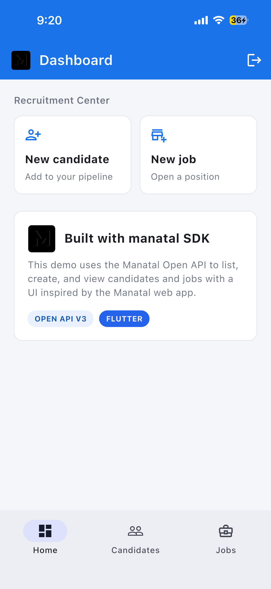
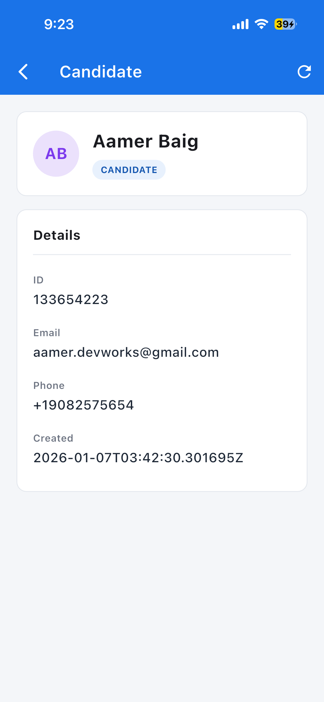
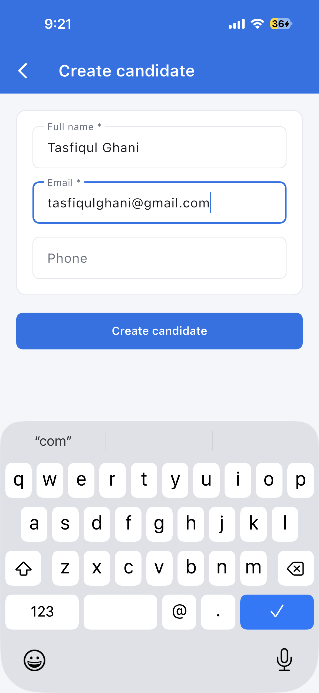
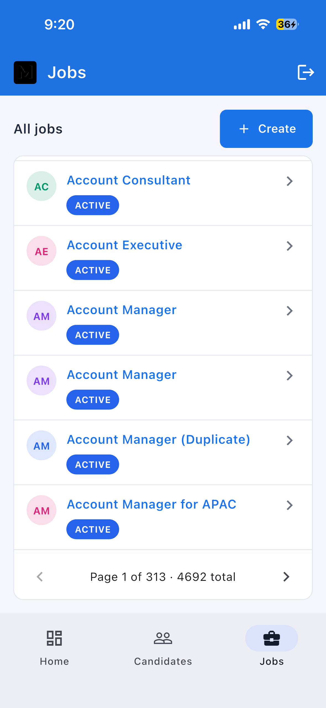
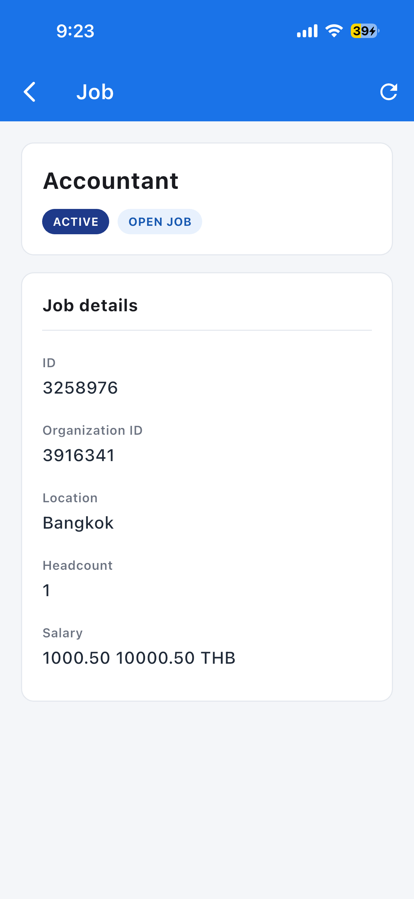

# Manatal Example App

A Flutter demo app for the [`manatal`](../) SDK — inspired by the [Manatal](https://app.manatal.com/) web UI.

## Features

- Connect with your Open API token
- List candidates and jobs with pagination
- View candidate and job details
- Create new candidates and jobs
- Manatal-style blue theme, badges, and cards

## Demo


## Screenshots

### Dashboard



### Candidates

**List**


**Detail**



**Create**




### Jobs

**List**



**Detail**



**Create**


## Run

From this folder:

```bash
flutter pub get
flutter run --dart-define=MANATAL_API_KEY=YOUR_OPEN_API_TOKEN
```

Or run without `--dart-define` and paste your token on the setup screen.

### iOS / Android

Native folders are included (`ios/`, `android/`, `macos/`). Run on simulator:

```bash
flutter run -d ios --dart-define=MANATAL_API_KEY=YOUR_OPEN_API_TOKEN
```

Build for iOS:

```bash
flutter build ios --dart-define=MANATAL_API_KEY=YOUR_OPEN_API_TOKEN
```

Open in Xcode:

```bash
open ios/Runner.xcworkspace
```

## Screens

| Screen | Media |
|--------|--------|
| Dashboard | [`home.PNG`](screenshots/home.PNG) |
| Candidates list | [`candidates.PNG`](screenshots/candidates.PNG) |
| Candidate detail | [`candidate_detail.PNG`](screenshots/candidate_detail.PNG) |
| Create candidate | [`create_candidate.PNG`](screenshots/create_candidate.PNG), [`create_candidate_form_filled.PNG`](screenshots/create_candidate_form_filled.PNG) |
| Jobs list | [`jobs.PNG`](screenshots/jobs.PNG) |
| Job detail | [`job_detail.PNG`](screenshots/job_detail.PNG) |
| Create job | [`create_job.PNG`](screenshots/create_job.PNG) |
| Walkthrough | [`demo.gif`](screenshots/demo.gif) |

## Token

Generate a token from [Open API settings](https://app.manatal.com/administration/features/open-api).
See the [Manatal Open API guide](https://support.manatal.com/docs/manatal-api).
